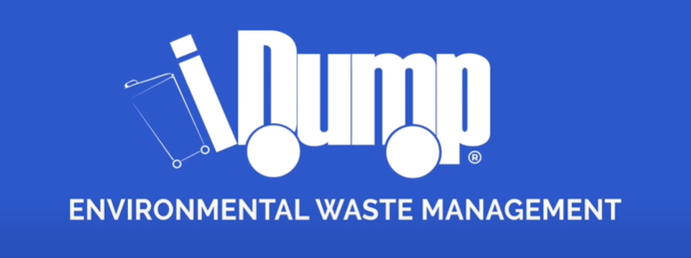
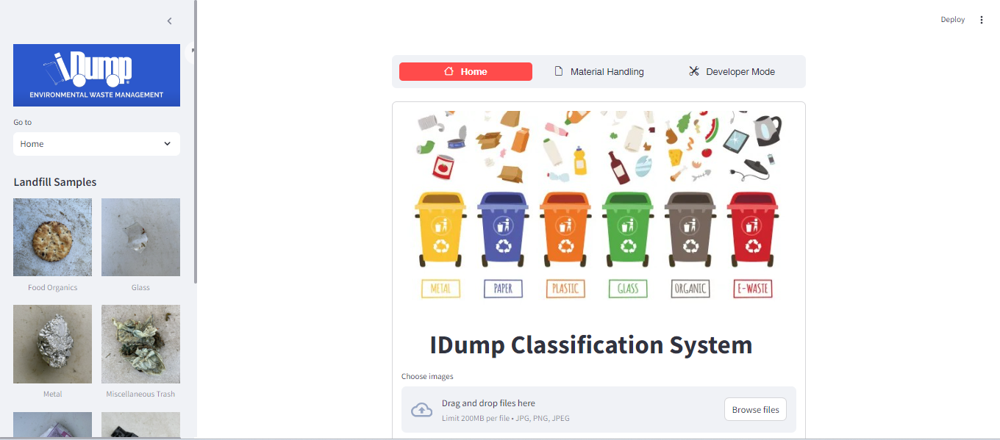
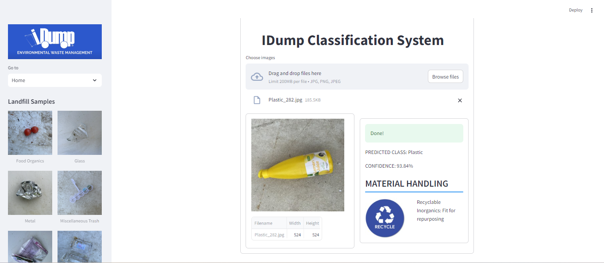
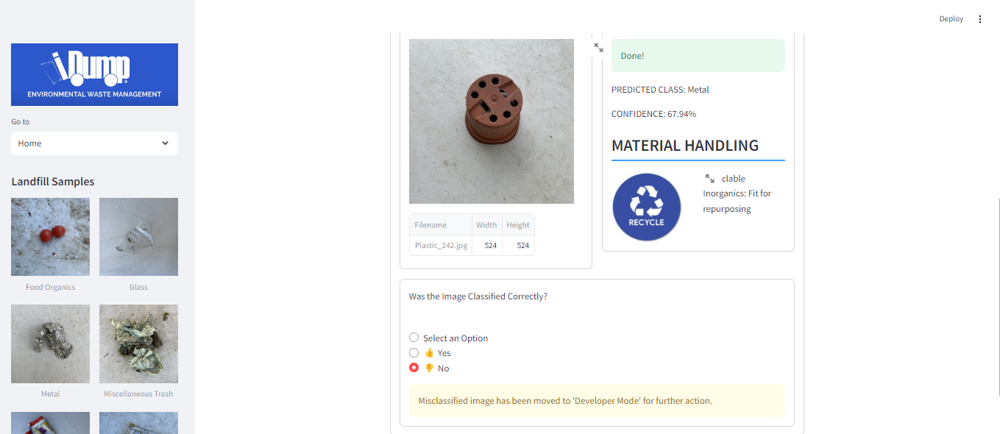
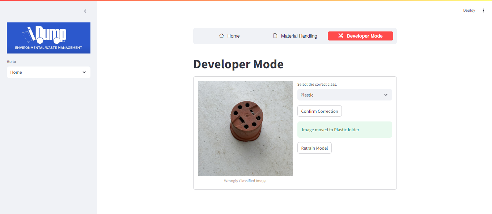

# IDUMP IMAGE CLASSIFICATION

## BUSINESS OVERVIEW

Konza City Technopolis is a burgeoning smart city in Kenya, designed to be a hub of technology, innovation, and sustainability. As part of its commitment to environmental sustainability, Konza City aims to implement advanced waste management solutions. iDump, a waste management company, has been contracted to develop and deploy an efficient waste segregation system that separates waste into different categories for recycling. This initiative will play a crucial role in maintaining the city’s cleanliness, reducing environmental impact, and promoting recycling practices.

### Problem Statement

Konza City Technopolis faces significant challenges in managing the diverse and large volume of waste generated by its residents and businesses. Trational waste management methods have proven to be inefficient, labor-intensive, and unable to cope with the scale of waste produced. This has led to increased environmental pollution, with a substantial portion of waste being improperly disposed of in landfills or open dumps. Furthermore, the lack of effective segregation and recycling facilities hampers the city’s ability to recycle valuable materials, leading to a significant loss of resources and economic opportunities.

### Objectives

**Main Objective:** Develop and deploy a robust image recognition system to enhance waste management efficiency in Konza City.

**Specific Objectives:**
1. Gather and preprocess a diverse dataset of waste images to ensure robust model training, including various types and conditions of waste items.
2. Analyze and report the most common types of waste collected.
3. Accurately classify waste into their distinct material types and categorize them into recyclable inorganics, divertible organics, and non-recyclable inorganic materials to improve waste management.
4. Deploy a user-friendly interface that allows iDump personnel/equipment to upload images and receive real-time classification results from the image recognition model.

### Metrics of Success:
- **Model Accuracy:** We aim for at least 80% accuracy in waste classification.
- **F1 Score:** We’ve set a target F1 score of 0.75 or higher to balance precision and recall.

## DATA UNDERSTANDING

The images used for this project were sourced from a Kaggle dataset by Joakim Arvidsso titled [RealWaste Image Classification](https://www.kaggle.com/datasets/joebeachcapital/realwaste ). It is a dataset of 8 major material types commonly collected within a landfill environment. 
The data has 4291 images that can be further classified into the following classes as below :
 

## MODELLING

6 models were built to tackle the classification problem:

1. A baseline CNN model with no augmentation
2. A CNN model with image augmentation
3. A 
4.
5. Pre-trained model using EfficientNetV2B0 architecture.
6. Pre-trained model using ResNet50 architecture.

Augmentation of the models ranged from Zoom range, shear range, rotation range, horizontal flip, width shift range and height shift range on the train models. As well as using custom model preprocessing functions with interesting results.

## DEPLOYMENT

Upon selection of the best model, we were able to deploy a model app for the classification problem.

Classification was successfully carried out on a majority of the classes.

However, some images were incorrectly classified as well. This was accommodated for in the app by introducing a section to verify if it  was correctly classified or not as a radio button.

A selectbox introduced a means to add that misclassified image to the training data of its correct class and retrain the model so as to continously improve  its accuracy.

## RESULTS AND CONCLUSIONS

**Results**

Our predictive modeling approach effectively addresses the challenge experienced by Konza City on their waste management. Using advanced neural network machine learning, we developed a model that accurately and efficiently categorizes real waste found in a landfill. The ResNet50 model provided the best performance achieving the highest accuracy across the board

**Conclusion**

This project provided a robust predictive model with continous model learning leveraging strong machine learning techniques. Understanding the needs of the Konza City administration to meet their goals on waste management and making it into an eco-diverse city, was crucial in providing a system that is user-friendly and easily integratable.  
Continuous updates and refinements are important to ensure the model remains accurate in predicting the waste in the city.

Implementing these models into their city will enhance the beauty of the city as well as improve the quality of life of its residents. Further improvements however can be noted as there is a need to tackle the rapidly increasing e-waste associated with the ease of acquiring electronics.

